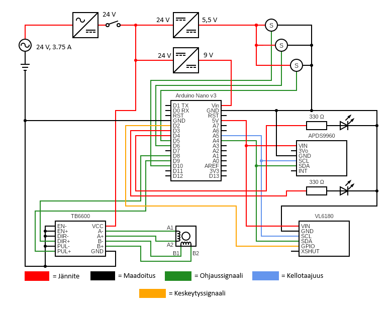

# Thesis-project-conveyor-belt-sorting-machine
This repository contains the code and a showcase of the conveyor belt sorting machine I designed and built as a part of my Master's thesis in Technology.  

# Video of the system at work
The machine detects different color and length blocks that pass through its sensors and pushes them off based on their color and length. By default the machine drops off all red, green and blue blocks that are under 50 mm long at different points of the belt, and logs event data through UART connection. Other blocks are passed through the belt. The attached video demonstrates the behavior.

# Explanation of the system

## Background

This project played a major role in my master's thesis in technology titled Embedded Systems-Focused Assignment for Software Testing Course. In my thesis I got to design a new, embedded systems-focused assignment for Tampere University's software testing course and test it with volunteer student groups. As a subject of the assignment I designed and implemented the system depicted in this repository. As the focus of the assignment, students got to plan and execute testing of the conveyor system and report their findings. 

## Hardware

The conveyor belt system is built around Atmel ATmega328P microcontroller operating the motor, actuators, sensors and logging. The sensors used are Adafruit APDS9960 module for color detection and Adafruit VL6180 Time-Of-Flight module for object detection. The conveyor belt is powered by a NEMA 17 stepper motor controlled through a TB6600 stepper driver. The rods used to push off blocks from the belt are attached to three small servo motors. The system gets its power from a 24 V, 3.75 A power supply with appropriate converters to lower the voltage for each component. A picture of the wiring can be seen below.

## Software

The operating logic of the system is based on an external interrupt from VL6180 ToF sensors window function. The sensor that is set up to point across the belt is set to activate a GPIO-pin when it detects a block in front of it. When the pin is activated, the microcontroller handles it as an interrupt routine and begins its operations. The time the block spends in front of the sensor is measured to determine the length of the block. During the time the block spends in front of the sensor the APDS9960 RGB sensor is used to take measurements of the color of the block. When the block has passed the sensor the color of the block is determined as an average of the color measurements and the length is calculated. After that, if the block is under 50 mm long and of color red, green or blue, a suitable actuation is scheduled and the block is pushed off the belt in the correct spot. All events are logged through UART and communicated to the machine's operator with general statistics and system status.

Another step-by-step breakdown of how the system works is at the end of this README.

Picture below shows the general software architecture of the firmware.

**KUVA**

The conveyor system firmware has been designed using a layered architecture. The picture above shows how the software modules are divided into four different layers. At the lowest level are the actual hardware and microcontroller, with the Hardware Abstraction Layer above them providing an interface for hardware control. Above the HAL layer is a layer of component-specific drivers, and at the top is the application layer containing the functional logic.

The software's Main file contains the initialization calls for the various components and modules, the configuration of initial parameters, and the actual main loop. The operation of the Main file is primarily confined to the application and driver layers, but it also includes some calls to the HAL layer and therefore does not strictly adhere to the principles of a layered architecture. Also not shown in the figure are the utils module, which handles logging, and the platform directory, which contains software parameters such as conveyor speed and information about the microcontroller pins.

The system's operational logic has been designed to function as a chain formed by the Sense, Decide, and Actuate modules in the application layer. In this chain, object detection is first performed in the Sense module, the observation is then analyzed in the Decide module, and finally the Actuate module handles servo motor movement and statistics updates.

## Step-by-step of the operation logic

**Before any blocks**

    The stepper driver keeps the belt moving at a set speed.
    The ToF sensor (VL6180) watches a small detection window over the belt and will pulse an interrupt when something enters or leaves that window.
    The color sensor (APDS9960) is sampling ambient light to be ready to read RGB+Clear when needed.
    The system's main loop is idle-watching: it polls for detection events, schedules actuations, and keeps a heartbeat log of counts when they change.

**When a block enters the detection window**

1. Detect enter

- VL6180 triggers an interrupt: “a block arrived.”

- The sense module debounces the event and records the “enter time” (t_enter_ms).
- A DETECT message is logged.

2. Block travels under the sensor

- The system waits (non-blocking) until VL6180 signals the block has left the window.

3. Detect exit and measure length

- On exit, the sense module marks the “exit time” (t_exit_ms), logs CLEAR, and computes:

    * Dwell = exit − enter (ms)

    * Estimated length = dwell × belt_speed_mm_per_s / 1000

    * Length class = small vs not-small (simple threshold)

4. Read color

- The APDS9960 is read for RGBC values and classified into RED/GREEN/BLUE/OTHER.

**Decide what to do with the block**

5. Route

- If not small: route = PASS_THROUGH (no diversion).

- If small: route by color → POS1 (RED), POS2 (GREEN), POS3 (BLUE); OTHER → PASS_THROUGH.

6. Guardrails and scheduling

- If route is PASS_THROUGH: increment “passed” and log PASS.

- If a diverter is chosen:

    * The scheduler computes when to fire based on the belt speed and the pre-measured distance from the sensor to that diverter.

    * It checks guardrails:

        Minimum spacing between actuations (avoid double-firing too quickly).

        Max blocks per minute (avoid overloading).

    * If accepted: it logs SCHEDULE and remembers the due time.

    * If rejected (guardrail hit): it treats the block as PASS (count + log).

**Actuation at the right moment**

Fire and auto-center

- As time advances, the main loop calls the scheduler (decide_tick). When “now ≥ due time,” it:

    * Fires the correct servo to push the block into POS1/2/3 and logs ACTUATE.

    * The servo auto-centers back to starting position after a short dwell, so it's ready for the next incoming block.

**Ongoing observability and control**

- Counts (total/diverted/passed/fault) are logged whenever they change or at least every few seconds.
- All timing runs non-blocking: the system never “waits,” it just tracks times and events and reacts when needed.

That’s it: detect → measure → classify → decide → schedule → actuate, with guardrails and clear logs/counters the whole way.
